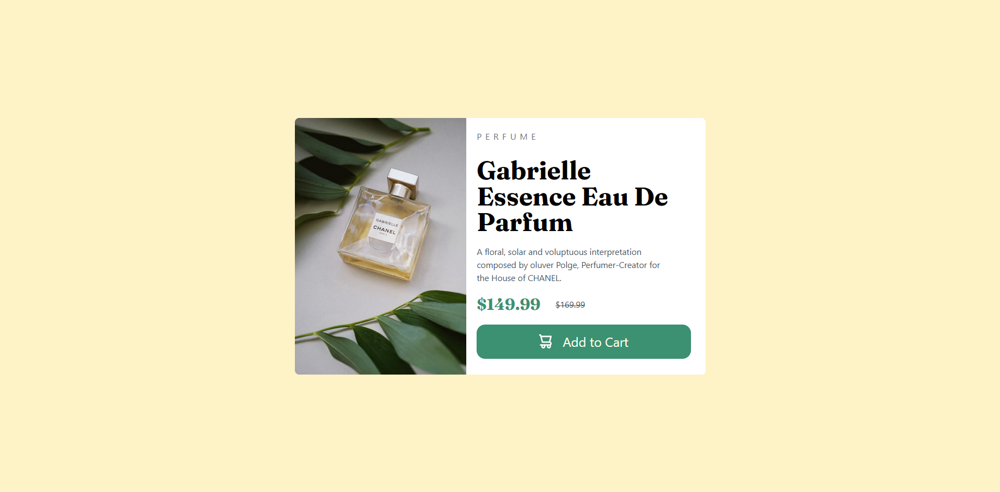

# Frontend Mentor - Product preview card component solution

This is a solution to the [Product preview card component challenge on Frontend Mentor](https://www.frontendmentor.io/challenges/product-preview-card-component-GO7UmttRfa).

## Table of contents

- [Overview](#overview)
  - [Screenshots](#screenshots)
  - [Links](#links)
- [My process](#my-process)
  - [Built with](#built-with)
  - [What I learned](#what-i-learned)
- [States](#states)
- [Author](#author)

## Overview

### Screenshots

### - Desktop View (Side-by-Side)


### - Mobile View (Stacked)


### Links

- Solution URL: [https://github.com/nu-amzad/card-design-frontendmentor](https://github.com/nu-amzad/card-design-frontendmentor)
- Live Site URL: [https://card-design-frontendmentor.netlify.app/](https://card-design-frontendmentor.netlify.app/)

## My process

### Built with

- Semantic HTML5 markup
- Mobile-first workflow
- [Tailwind CSS](https://tailwindcss.com/) - Utility classes
- [Vite](https://vitejs.dev/) - Development Tool
- Responsive Design (Flex-direction toggle)

### What I learned

The core challenge of this project was transitioning the card from a vertical stack on mobile to a horizontal layout on desktop. I achieved this by using Tailwind's `flex-col md:flex-row` classes.

I also learned how to handle responsive imagery by toggling image visibility based on breakpoints:

```html


```

## Author

- Frontend Mentor - [@nu-amzad](https://www.frontendmentor.io/profile/nu-amzad)